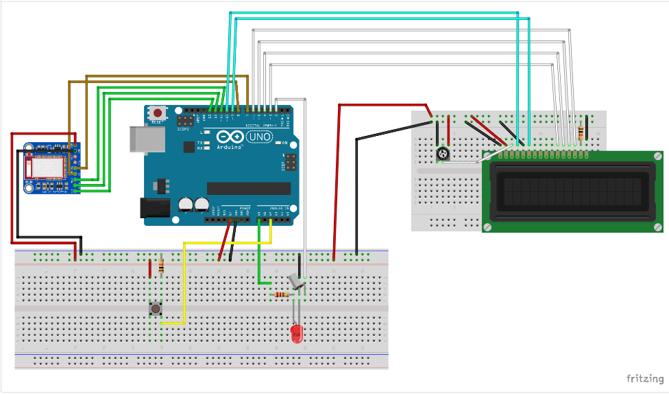
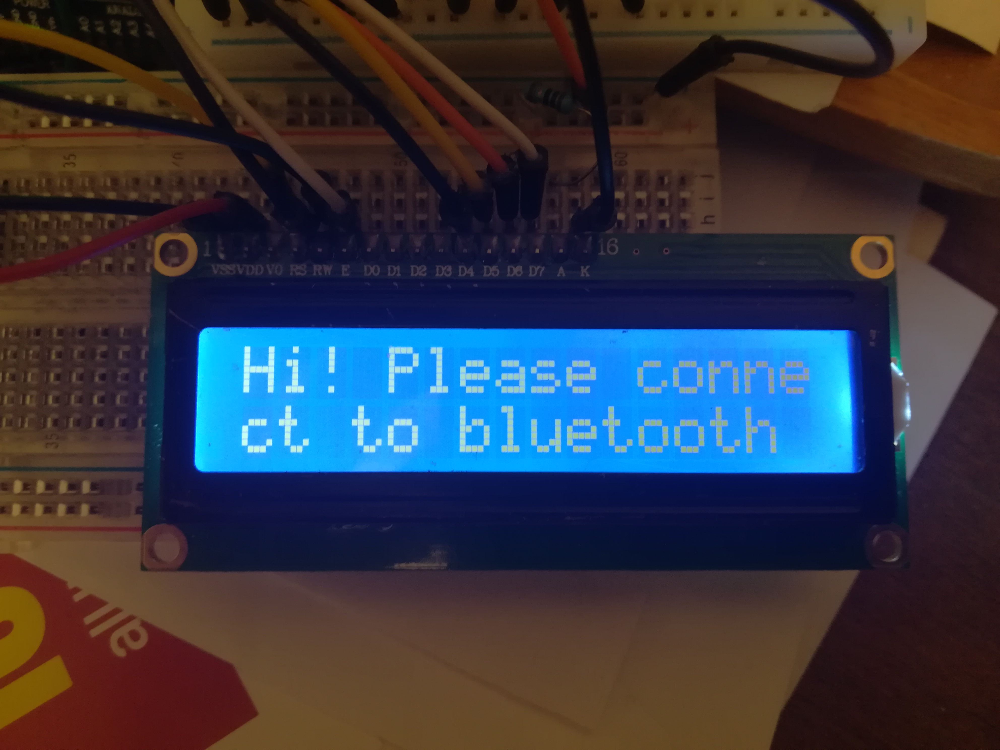
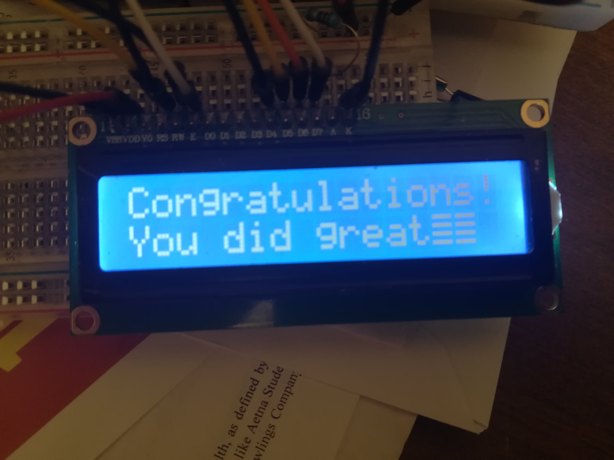

# My Arduino Project: the bluetooth connected step-counter

## Why 

After a surgery and 8 months of physical therapy, I was quite afraid to be on my own to continue healing myself. That is when my physical therapist showed me this app, on which she could give me exercices at home and monitor my progress. I also have this app on my phone which counts the steps that I do on a daily basis. 
This is when I came with this idea: a bluetooth connected step counter. I know that obesity in America is still a big issue. The patient and the doctor would agree face-to-face on a daily goal and implement it on the app. Thus, the patient would know when he would meet his daily goal. 

## Overview

I used an Arduino UNO connected to an Adafruit Bluetooth device, Bluefruit LE. It allows the data transmission via bluetooth. M Arduino is powered via a 5000mAh phone portable battery pack. For data presentation, I used a basic LCD 16x2. My data, the number of steps, was collected via a tilt sensor. Here is the wiring of my project:

The led was only used for testing and does not play a major role in the functionning of the project. The main interface with the user is the LCD screen.

And here is what my project looks like:

The tilt sensor is this simple device:

The tilt sensor acts as a switch. When inclined, the ball inside moves to the other side and connects the 2 wires inside, thus closing the switch and allowing the current to go through.

## How does it work ?

First, the user is welcomed and ask to connect to Bluetooth. Since we are using Bluefruit LE, we are using the Bluefruit LE app, available on the Android Playstore : 

Once connected, the Goal of the day is displayed on the screen during a couple seconds on the LCD, followed by "Go!", which is when you can start using the step counter. 
Your steps will increment on the LCD screen but also on your Bluefruitapp.

Once you reach the goal of the day, this message is displayed:

.

## Cost & Comparison

The Arduino UNO costs around 20$. The LCD is about 2$, the Adafruit device is 20$, the powerbank is 10$. The total cost would be around 60$. 
You can find bluetooth connected podometers are today around 30$. I would explain the 30$ difference by the medical individualized advice guarantee and the fact that this is an open source project, so a lot of adds-on are possible.

